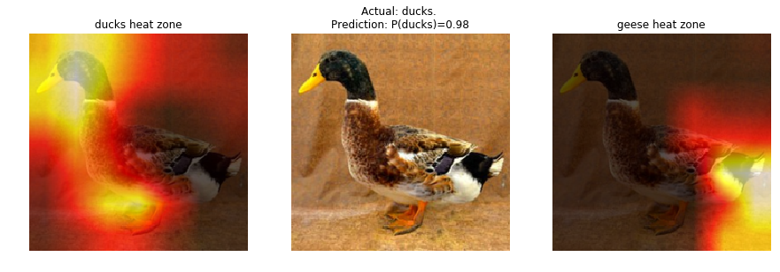

# duckgoose
Utility scripts for the online [fast.ai](www.fast.ai) course. There are two main parts: one to download and organise arbitrary image classes, and one to highlight what parts of an image is activating the decision for a classification.

1. Utility for Lesson 1 experimentation with external image classes. The script:
* Downloads images from google images for specific classes
* Sanity checks that images can be opened and have three channels
* Organises the images into separate folders (train/valid/test + classes) as expected by the fast.ai library

2. Utility for creating Class Activation Maps for both classifications.

## Prerequisites 

* `chromedriver` is required. On ubuntu/debian: `sudo apt-get chromium-chromedriver`

## Installation

```python
pip install duckgoose
```

## Usage

### Fetching, sanity checking and organising images

```python
from duckgoose import fetchImagesAndPrepForClassification

# dictionary structure `class_name => search term`
image_classes = { 'ducks' : 'ducks -rubber' , 'geese' : 'geese' }
download_path = '/home/myuser/data/downloaded_from_google'
output_path = '/home/myuser/data/ducksgeese/'
number_of_images = 100

fetchImagesAndPrepForClassification(image_classes, download_path, output_path, number_of_images)
```

### Create Class Activation Maps (CAM)
*Note*: This was implemented for fastai v2 part 1.
Here is a full example of creating a class activation maps for ducks and geese using fast ai. 

```python
from fastai.imports import *
from fastai.transforms import *
from fastai.conv_learner import *
from fastai.model import *
from fastai.dataset import *
from fastai.sgdr import *
from fastai.plots import *

from duckgoose.cam import calculateAndChartHeatZoneFor

PATH = "data/ducksgeese/"
sz=224
arch = resnet34
bs = 64

m = arch(True)
m = nn.Sequential(*children(m)[:-2], 
                  nn.Conv2d(512, 2, 3, padding=1), 
                  nn.AdaptiveAvgPool2d(1),
                  Flatten(), 
                  nn.LogSoftmax())

tfms = tfms_from_model(arch, sz, aug_tfms=transforms_side_on, max_zoom=1.1)
data = ImageClassifierData.from_paths(PATH, tfms=tfms, bs=bs)
learn = ConvLearner.from_model_data(m, data)

learn.freeze_to(-4)

_, val_tfms = tfms_from_model(learn.model, sz)

learn.fit(0.01, 2)

calculateAndChartHeatZoneFor('./data/ducksgeese/test/ducks/ducks_427.jpg', val_tfms, learn)
```




# License
[The MIT License (MIT)](LICENSE.txt)
